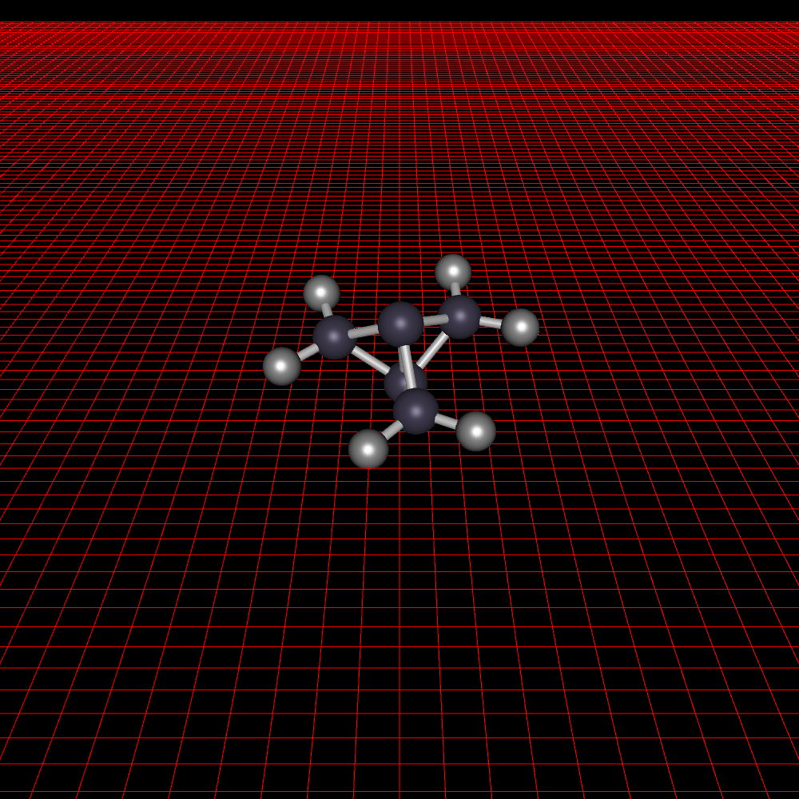

# 分子描画

VASP用のINPUTファイルのPOSCARや，Gaussian用のxyzファイルから分子を描画するコマンドラインツール．

## 詳細

コマンドラインで引数にファイル名を指定してOpenGLで描画します．




obj形式のファイル出力も可能です．

## 使い方

分子描画．スクリーンショットは描画中にEnter．
`main -i POSCAR`

obj形式のファイル出力
`main -i POSCAR --oobj example.obj`

## インストール方法

```
mkdir build && cd build
cmake ..
make
```
実行ファイル`main`が生成されます．
